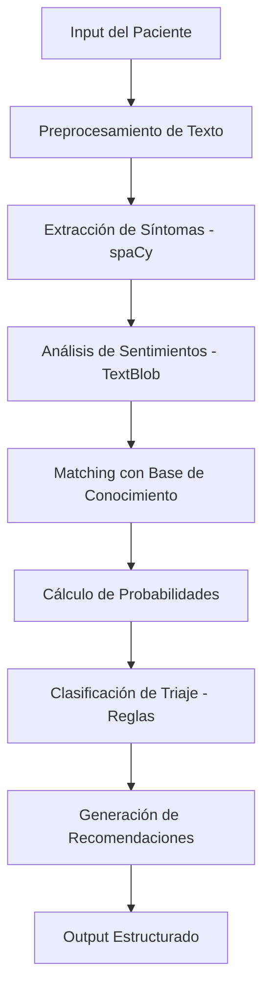

# 🔧 Arquitectura Técnica del Sistema de Triaje Médico

## 📋 Resumen del Sistema Actual

El sistema utiliza un enfoque **híbrido** que combina **procesamiento de lenguaje natural** tradicional con **algoritmos de matching inteligente**, sin depender de modelos de Deep Learning complejos.

## 🛠️ Stack Tecnológico

### **Core Technologies**
- **Python 3.8+** - Lenguaje base del sistema
- **Streamlit** - Framework para interfaz web interactiva
- **spaCy** - Procesamiento de lenguaje natural en español
- **scikit-learn** - Algoritmos de machine learning tradicional
- **TextBlob** - Análisis de sentimientos y polaridad de texto

### **Data Processing**
- **Pandas** - Manipulación y análisis de datos
- **NumPy** - Operaciones numéricas y arrays
- **NLTK** - Herramientas adicionales de NLP

### **Visualization & UI**
- **Matplotlib** - Gráficos y visualizaciones
- **Seaborn** - Visualizaciones estadísticas
- **Plotly** - Gráficos interactivos

## 🧠 Metodología de Predicción

### **1. Análisis de Síntomas (SymptomAnalyzer)**
```python
# Tecnología: spaCy + TextBlob + Regex
- Extracción de síntomas mediante coincidencia de palabras clave
- Categorización en 5 sistemas: cardiovascular, respiratorio, neurológico, digestivo, dolor
- Evaluación de severidad: leve, moderado, severo
- Análisis de sentimientos para detectar ansiedad/urgencia
```

### **2. Predicción de Enfermedades (DiseasePredictor)**
```python
# Tecnología: Matching Manual + Scoring Algorithm
- Base de conocimiento con 13 enfermedades categorizadas
- Algoritmo de coincidencia de síntomas
- Cálculo de probabilidades basado en matches
- Sin entrenamiento de ML - determinístico
```

### **3. Clasificación de Triaje (TriageClassifier)**
```python
# Tecnología: Rule-Based System + Medical Protocols
- Sistema basado en reglas médicas estándar
- 5 niveles de triaje hospitalario
- Criterios específicos por nivel de urgencia
- Recomendaciones automáticas de tratamiento
```

## 📊 Ventajas del Enfoque Actual

### **✅ Fortalezas**
- **🚀 Rapidez**: Tiempo de respuesta < 1 segundo
- **🔍 Interpretabilidad**: Resultados completamente explicables
- **🛡️ Determinismo**: Mismo input = mismo output
- **📱 Ligereza**: No requiere GPU ni modelos pesados
- **🔧 Mantenibilidad**: Fácil de debuggear y modificar
- **💰 Costo-efectivo**: Sin necesidad de infraestructura compleja

### **⚠️ Limitaciones**
- **📚 Escalabilidad**: Base de conocimiento manual limitada
- **🧠 Aprendizaje**: No aprende de nuevos casos
- **🔤 NLP Básico**: Matching simple de palabras clave
- **🌐 Idiomas**: Limitado a español principalmente
- **🎯 Precisión**: Dependiente de la calidad de la base de conocimiento

## 🔄 Flujo de Procesamiento



## 📈 Evolución Planificada

### **Fase 2: ML Tradicional Mejorado**
- **Feature Engineering** más sofisticado
- **Ensemble Methods** (Random Forest + XGBoost)
- **Cross-validation** con datos médicos reales
- **Hyperparameter tuning** automático

### **Fase 3: Deep Learning**
- **BERT médico** pre-entrenado
- **Transformer models** especializados
- **Neural networks** para patrones complejos
- **Transfer learning** desde modelos biomédicos

### **Fase 4: Sistema Híbrido Avanzado**
- **Knowledge graphs** médicos
- **Reasoning engines** para diagnóstico
- **Multi-modal input** (texto + imágenes + vitales)
- **Continuous learning** desde feedback médico

## 🎯 Casos de Uso Actuales

### **✅ Funciona Bien Para:**
- Síntomas comunes y bien definidos
- Casos de emergencia obvios (infarto, ACV)
- Triaje básico en urgencias
- Educación médica y training

### **⚠️ Limitaciones Para:**
- Casos complejos con múltiples comorbilidades
- Síntomas raros o atípicos
- Diagnóstico diferencial sofisticado
- Poblaciones pediátricas específicas

## 📝 Conclusión

El sistema actual representa un **MVP (Minimum Viable Product)** robusto que demuestra el potencial de la tecnología en triaje médico, utilizando herramientas accesibles y probadas. La arquitectura está diseñada para evolucionar gradualmente hacia soluciones más sofisticadas sin comprometer la estabilidad del sistema base.

**Enfoque**: Tecnología pragmática y accesible como base para innovación médica escalable.